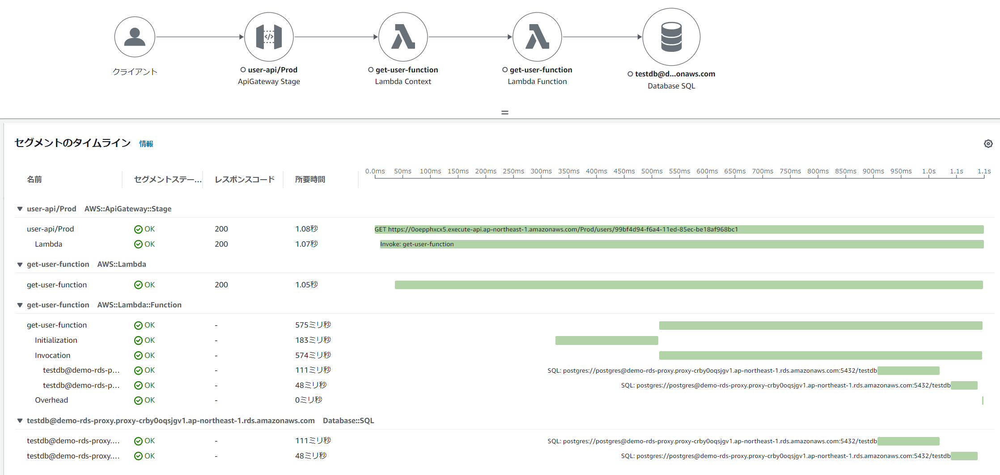

# Private APIでのAPIGatewayを使ったLambda/GoのAWS SAMサンプルAP

## 構成イメージ
* API GatewayをPrivate APIで公開
    * VPC内にEC2で構築した、Bastionからアクセスする
* LambdaからDynamoDBやRDS AuroraへのDBアクセスを実現
    * LambdaはVPC内Lambdaとして、RDS Aurora（RDS Proxy経由）でのアクセスも可能としている


* X-Rayによる可視化
    * API Gateway、Lambdaにおいて、X-Rayによる可視化にも対応している
    * RDB(RDS Aurora)へのアクセス、DynamoDBへのアクセスのトレースにも対応



## 1. IAMの作成
```sh
#cfnフォルダに移動
cd cfn
aws cloudformation validate-template --template-body file://cfn-iam.yaml
aws cloudformation create-stack --stack-name Demo-IAM-Stack --template-body file://cfn-iam.yaml --capabilities CAPABILITY_IAM
```

## 2. VPCおよびサブネット、InternetGateway等の作成
```sh
aws cloudformation validate-template --template-body file://cfn-vpc.yaml
aws cloudformation create-stack --stack-name Demo-VPC-Stack --template-body file://cfn-vpc.yaml
```

## 3. Security Groupの作成
```sh
aws cloudformation validate-template --template-body file://cfn-sg.yaml
aws cloudformation create-stack --stack-name Demo-SG-Stack --template-body file://cfn-sg.yaml
```

## 4. VPC Endpointの作成とプライベートサブネットのルートテーブル更新
* VPC内LambdaからDynamoDBへアクセスするためのVPC Endpointを作成
```sh
aws cloudformation validate-template --template-body file://cfn-vpe.yaml
aws cloudformation create-stack --stack-name Demo-VPE-Stack --template-body file://cfn-vpe.yaml
```
## 5. NAT Gatewayの作成とプライベートサブネットのルートテーブル更新
* VPC内Lambdaからインターネットに接続する場合に必要となる。
* hello-worldのサンプルAPでは、[https://checkip.amazonaws.com](https://checkip.amazonaws.com)へアクセスしに行くので、これを試す場合には作成が必要となる。

```sh
aws cloudformation validate-template --template-body file://cfn-ngw.yaml
aws cloudformation create-stack --stack-name Demo-NATGW-Stack --template-body file://cfn-ngw.yaml
```

## 6. RDS Aurora Serverless v2 for PostgreSQL、SecretsManager、RDS Proxy作成
* リソース作成に少し時間がかかる。(20分程度)
```sh
aws cloudformation validate-template --template-body file://cfn-rds.yaml
aws cloudformation create-stack --stack-name Demo-RDS-Stack --template-body file://cfn-rds.yaml --parameters ParameterKey=DBUsername,ParameterValue=postgres ParameterKey=DBPassword,ParameterValue=password
```

## 7. EC2(Bastion)の作成
* psqlによるRDBのテーブル作成や、APIGatewayのPrivate APIにアクセスするための踏み台を作成
```sh
aws cloudformation validate-template --template-body file://cfn-bastion-ec2.yaml
aws cloudformation create-stack --stack-name Demo-Bastion-Stack --template-body file://cfn-bastion-ec2.yaml
```

* 必要に応じてキーペア名等のパラメータを指定
    * 「--parameters ParameterKey=KeyPairName,ParameterValue=myKeyPair」

## 8. RDBのテーブル作成
* マネージドコンソールからEC2にセッションマネージャで接続し、Bastionにログインする。psqlをインストールし、DB接続する。
    * 以下参考に、Bastionにpsqlをインストールするとよい
        * https://techviewleo.com/how-to-install-postgresql-database-on-amazon-linux/
* DB接続後、ユーザテーブルを作成する。        
```sh
sudo amazon-linux-extras install epel

sudo tee /etc/yum.repos.d/pgdg.repo<<EOF
[pgdg14]
name=PostgreSQL 14 for RHEL/CentOS 7 - x86_64
baseurl=http://download.postgresql.org/pub/repos/yum/14/redhat/rhel-7-x86_64
enabled=1
gpgcheck=0
EOF

sudo yum makecache
sudo yum install postgresql14

#Auroraに直接接続
#CloudFormationのDemo-RDS-Stackスタックの出力「RDSClusterEndpointAddress」の値を参照
psql -h (Auroraのクラスタエンドポイント) -U postgres -d testdb    

#ユーザテーブル作成
CREATE TABLE IF NOT EXISTS m_user (user_id VARCHAR(50) PRIMARY KEY, user_name VARCHAR(50));
#ユーザテーブルの作成を確認
\dt
#いったん切断
\q

#RDS Proxyから接続しなおす
#CloudFormationのDemo-RDS-Stackスタックの出力「RDSProxyEndpoint」の値を参照
psql -h (RDS Proxyのエンドポイント) -U postgres -d testdb
#ユーザテーブルの存在を確認
\dt

```

## 9. DynamoDBのテーブル作成
* DynamoDBにTODOテーブルを作成する。
```sh
aws cloudformation validate-template --template-body file://cfn-dynamodb.yaml
aws cloudformation create-stack --stack-name Demo-DynamoDB-Stack --template-body file://cfn-dynamodb.yaml
```


## 10. AWS SAMでLambda/API Gatewayのデプロイ       
* SAMビルド    
```sh
# トップのフォルダに戻る
cd ..
sam build
# Windowsにmakeをインストールすればmakeでもいけます
make
```

* 必要に応じてローカル実行可能(hello-worldのみ)
```sh
sam local invoke
sam local start-api
curl http://127.0.0.1:3000/hello
```

* SAMデプロイ
```sh
# 1回目は
sam deploy --guided
# Windowsにmakeをインストールすればmakeでもいけます
make deploy_guided

# 2回目以降は
set DB_USER_NAME=postgres
set DB_PASSWORD=password
sam deploy --parameter-overrides DBUsername=%DB_USER_NAME% DBPassword=%DB_PASSWORD%
# Windowsにmakeをインストールすればmakeでもいけます
set DB_USER_NAME=postgres
set DB_PASSWORD=password
make deploy
```

* （参考）再度ビルドするとき
```sh
# .aws-sam配下のビルド資材を削除
rmdir /s /q .aws-sam
# ビルド
sam build

# Windowsにmakeをインストールすればmakeでもいけます
make
```


## 11. APの実行確認
* マネージドコンソールから、EC2(Bation)へSystems Manager Session Managerで接続して、curlコマンドで動作確認
    * 以下の実行例のURLを、sam deployの結果出力される実際のURLをに置き換えること

* hello-worldのAPI実行例    
```sh
curl https://5h5zxybd3c.execute-api.ap-northeast-1.amazonaws.com/Prod/hello

# 接続元Public IPアドレス（この例では、NAT Gatewayのもの）を返却
Hello, 18.180.139.158
```

* Userサービスでユーザ情報を登録するPOSTのAPI実行例
    * UserサービスはRDB(RDS Proxy経由でAuroraへ)アクセスするLambda/goのサンプルAP
```sh
curl -X POST -H "Content-Type: application/json" -d '{ "name" : "Taro"}' https://42b4c7bk9g.execute-api.ap-northeast-1.amazonaws.com/Prod/users

# 登録結果を返却
{"user_id":"99bf4d94-f6a4-11ed-85ec-be18af968bc1","user_name":"Taro"}
```

* Userサービスでユーザー情報を取得するGetのAPIの実行例（users/の後にPOSTのAPIで取得したユーザIDを指定）
```sh
curl https://42b4c7bk9g.execute-api.ap-northeast-1.amazonaws.com/Prod/users/99bf4d94-f6a4-11ed-85ec-be18af968bc1

# 対象のユーザ情報をRDBから取得し返却
{"user_id":"99bf4d94-f6a4-11ed-85ec-be18af968bc1","user_name":"Taro"}
```

* Todoサービスでやることリストを登録するPOSTのAPI実行例
    * TodoサービスはDynamoDBアクセスするLambda/goのサンプルAP
```sh
curl -X POST -H "Content-Type: application/json" -d '{ "todo_title" : "ミルクを買う"}' https://civuzxdd14.execute-api.ap-northeast-1.amazonaws.com/Prod/todo

# 登録結果を返却
{"todo_id":"04a14ad3-f6a5-11ed-b40f-f2ead45b980a","todo_title":"ミルクを買う"}
```

* Todoサービスでやること（TODO）を取得するGetのAPI実行例（todo/の後にPOSTのAPIで取得したTodo IDを指定）
```sh
curl https://civuzxdd14.execute-api.ap-northeast-1.amazonaws.com/Prod/todo/04a14ad3-f6a5-11ed-b40f-f2ead45b980a

# 対象のやることをDyanamoDBから取得し返却
{"todo_id":"04a14ad3-f6a5-11ed-b40f-f2ead45b980a","todo_title":"ミルクを買う"}
```
## 12. SAMのCloudFormationスタック削除
```sh
sam delete
# Windowsにmakeをインストールすればmakeでもいけます
make delete
```

## 13. その他リソースのCloudFormationスタック削除
```sh
aws cloudformation delete-stack --stack-name Demo-Bastion-Stack
aws cloudformation delete-stack --stack-name Demo-DynamoDB-Stack
aws cloudformation delete-stack --stack-name Demo-RDS-Stack
aws cloudformation delete-stack --stack-name Demo-NATGW-Stack
aws cloudformation delete-stack --stack-name Demo-VPE-Stack
aws cloudformation delete-stack --stack-name Demo-SG-Stack
aws cloudformation delete-stack --stack-name Demo-VPC-Stack 
aws cloudformation delete-stack --stack-name Demo-IAM-Stack 
```