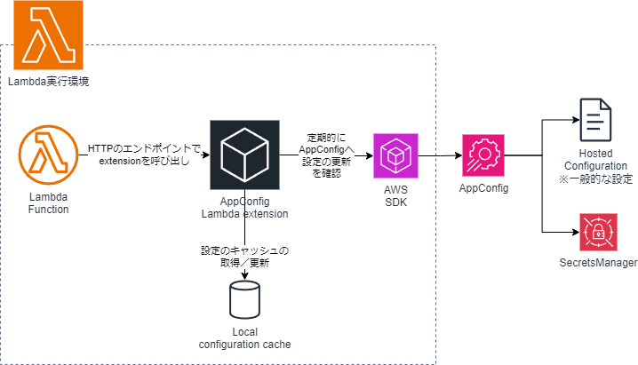
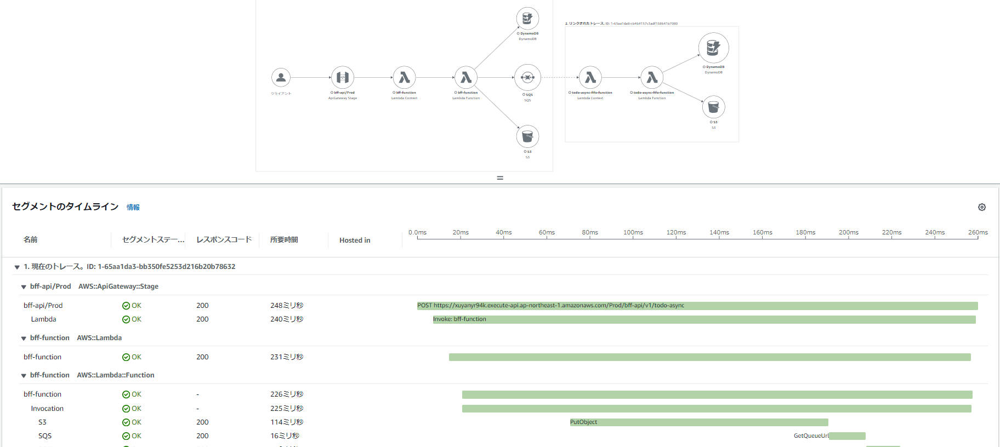

# Lambda/GoのAWS SAMサンプルAP
## 構成イメージ
* オンラインリアルタイム処理方式
    * API GatewayをトリガにLambda実行
    * Private APIで公開、VPC内にEC2で構築した、Bastionからアクセスする構成に対応
    * LambdaからDynamoDBやRDS AuroraへのDBアクセスへのアクセスを実現
    * LambdaはVPC内Lambdaとして、RDS Aurora（RDS Proxy経由）でのアクセスも可能としている

* ディレード処理方式
    * Lambdaから、SQSへのアクセスし、非同期処理の実行依頼を実現
    * SQSトリガにLambda実行
    * 標準キュー、FIFOキューの両方に対応
    * DynamoDBのトランザクション管理機能を利用した、メッセージ送達とDynamoDBトランザクションの整合性を担保する仕組みを実装

* LambdaからのDynamoDB、SQSといった各種AWSリソースへのアクセスに対応
    * AWS SDK for Go v2に対応
    * AWS SDKやX-Ray SDKの利用方法がv1の時と変更になっている


* Lambda間の呼び出しイメージ
    * サンプルAP上、直接User API、Todo APIサービスを呼ぶこともできるがバックエンドサービス扱い
    * BFFからバックエンドの各サービスへアクセスする、SQSを介してディレード実行するという呼び出し関係になっている    


* AppConfigによる設定の外部化
    * [AppConfig](https://docs.aws.amazon.com/ja_jp/appconfig/latest/userguide/what-is-appconfig.html)を使用し、APから外部管理された設定の取得、AppConfig機能を使ったデプロイに対応している。
    * マネージドなLambdaレイヤにより提供される[AppConfig Agent Lambdaエクステンション](https://docs.aws.amazon.com/ja_jp/appconfig/latest/userguide/appconfig-integration-lambda-extensions.html)を使って、LambdaアプリケーションからAppConfigの設定をキャッシュするとともに、アプリケーションの再デプロイ不要で設定変更を反映することができる。



* X-Rayによる可視化
    * API Gateway、Lambdaにおいて、X-Rayによる可視化にも対応している
    * RDB(RDS Aurora)、DynamoDBへのアクセス、REST API、SQSの呼び出しのトレースにも対応
    * RDB(Aurora)アクセスの可視化の例
        
    * DynamoDBアクセスの可視化の例
        
    * REST APIの呼び出しの可視化の例
        
    * SQS呼び出しの可視化の例
        

* RDS Proxyの利用時の注意（ピン留め）
    * SQLを記載するにあたり、従来はプリペアドステートメントを使用するのが一般的であるが、RDS Proxyを使用する場合には、[ピン留め(Pinning)](https://docs.aws.amazon.com/AmazonRDS/latest/UserGuide/rds-proxy-managing.html#rds-proxy-pinning)という現象が発生してしまう。その間、コネクションが切断されるまで占有されつづけてしまい再利用できず、大量のリクエストを同時に処理する場合にはコネクション枯渇し性能面に影響が出る恐れがある。
        * ピン留めが発生してるかについては、CloudWatch Logsでロググループ「/aws/
        rds/proxy/demo-rds-proxy」を確認して、以下のような文言が出ていないか確認するとよい。

        ```
        The client session was pinned to the database connection [dbConnection=…] for the remainder of the session. The proxy can't reuse this connection until the session ends. Reason: A parse message was detected.
        ```

    * 本サンプルAPのRDBアクセス処理では、プリペアドステートメントを使用しないよう実装することで、ピン留めが発生しないようにしている。注意点として、SQLインジェクションが起きないようにエスケープ処理を忘れずに実装している。

    * なお、本サンプルAPのようにX-Ray SDKでSQLトレースする場合、[xray.SQLContext関数を利用する](https://docs.aws.amazon.com/ja_jp/xray/latest/devguide/xray-sdk-go-sqlclients.html)際に確立するDBコネクションでピン留めが発生する。
        * xray.SQLContext関数を利用する際に、内部で発行されるSQL（"SELECT version(), current_user, current_database()"）がプリペアドステートメントを使用しているためピン留めが発生する。ピン留めの発生は回避できないとのこと。ただ、CloudWatchのRDS Proxyのログを見ても分かるが、直ちにコネクション切断されるため、ピン留めによる影響は小さいと想定される。（AWSサポート回答より）

## 事前準備
* ローカル環境に、AWS CLI、AWS SAM CLI、Docker環境が必要

## 1. IAMの作成
```sh
#cfnフォルダに移動
cd cfn
aws cloudformation validate-template --template-body file://cfn-iam.yaml
aws cloudformation create-stack --stack-name Demo-IAM-Stack --template-body file://cfn-iam.yaml --capabilities CAPABILITY_IAM
```

## 2. VPCおよびサブネット、InternetGateway等の作成
```sh
aws cloudformation validate-template --template-body file://cfn-vpc.yaml
aws cloudformation create-stack --stack-name Demo-VPC-Stack --template-body file://cfn-vpc.yaml
```

## 3. Security Groupの作成
```sh
aws cloudformation validate-template --template-body file://cfn-sg.yaml
aws cloudformation create-stack --stack-name Demo-SG-Stack --template-body file://cfn-sg.yaml
```

## 4. VPC Endpointの作成とプライベートサブネットのルートテーブル更新
* API GatewayのPrivate APIのためのVPC Endpointや、VPC内LambdaからDynamoDB、SQS、AppConfig等へアクセスするためのVPC Endpointを作成
```sh
aws cloudformation validate-template --template-body file://cfn-vpe.yaml
aws cloudformation create-stack --stack-name Demo-VPE-Stack --template-body file://cfn-vpe.yaml
```
## 5. NAT Gatewayの作成とプライベートサブネットのルートテーブル更新
* VPC内Lambdaからインターネットに接続する場合に必要となる。
    * hello-worldのサンプルAPでは[https://checkip.amazonaws.com](https://checkip.amazonaws.com)へアクセスしに行くため必要。

```sh
aws cloudformation validate-template --template-body file://cfn-ngw.yaml
aws cloudformation create-stack --stack-name Demo-NATGW-Stack --template-body file://cfn-ngw.yaml
```

## 6. RDS Aurora Serverless v2 for PostgreSQL、SecretsManager、RDS Proxy作成
* リソース作成に少し時間がかかる。(20分程度)
```sh
aws cloudformation validate-template --template-body file://cfn-rds.yaml
aws cloudformation create-stack --stack-name Demo-RDS-Stack --template-body file://cfn-rds.yaml --parameters ParameterKey=DBUsername,ParameterValue=postgres ParameterKey=DBPassword,ParameterValue=password
```

## 7. EC2(Bastion)の作成
* psqlによるRDBのテーブル作成や、APIGatewayのPrivate APIにアクセスするための踏み台を作成
```sh
aws cloudformation validate-template --template-body file://cfn-bastion-ec2.yaml
aws cloudformation create-stack --stack-name Demo-Bastion-Stack --template-body file://cfn-bastion-ec2.yaml
```

* 必要に応じてキーペア名等のパラメータを指定
    * 「--parameters ParameterKey=KeyPairName,ParameterValue=myKeyPair」

## 8. RDBのテーブル作成
* マネージドコンソールからEC2にセッションマネージャで接続し、Bastionにログインする。psqlをインストールし、DB接続する。
    * 以下参考に、Bastionにpsqlをインストールするとよい
        * https://techviewleo.com/how-to-install-postgresql-database-on-amazon-linux/
* DB接続後、ユーザテーブルを作成する。        
```sh
sudo amazon-linux-extras install -y epel

sudo tee /etc/yum.repos.d/pgdg.repo<<EOF
[pgdg14]
name=PostgreSQL 14 for RHEL/CentOS 7 - x86_64
baseurl=http://download.postgresql.org/pub/repos/yum/14/redhat/rhel-7-x86_64
enabled=1
gpgcheck=0
EOF

sudo yum makecache
sudo yum install -y postgresql14

#Auroraに直接接続
#CloudFormationのDemo-RDS-Stackスタックの出力「RDSClusterEndpointAddress」の値を参照
psql -h (Auroraのクラスタエンドポイント) -U postgres -d testdb    

#ユーザテーブル作成
CREATE TABLE IF NOT EXISTS m_user (user_id VARCHAR(50) PRIMARY KEY, user_name VARCHAR(50));
#ユーザテーブルの作成を確認
\dt
#いったん切断
\q

#RDS Proxyから接続しなおす
#CloudFormationのDemo-RDS-Stackスタックの出力「RDSProxyEndpoint」の値を参照
psql -h (RDS Proxyのエンドポイント) -U postgres -d testdb
#ユーザテーブルの存在を確認
\dt

```

## 9. DynamoDBのテーブル作成
* DynamoDBに「todo」、「temp」、「queue_message」の各テーブルを作成する。
```sh
aws cloudformation validate-template --template-body file://cfn-dynamodb.yaml
aws cloudformation create-stack --stack-name Demo-DynamoDB-Stack --template-body file://cfn-dynamodb.yaml
```

## 10. SQSの作成
```sh
aws cloudformation validate-template --template-body file://cfn-sqs.yaml
aws cloudformation create-stack --stack-name Demo-SQS-Stack --template-body file://cfn-sqs.yaml
```

## 11. AppConfigの作成
* AppConfigの基本リソースを作成する。
```sh
aws cloudformation validate-template --template-body file://cfn-appconfig.yaml
aws cloudformation create-stack --stack-name Demo-AppConfig-Stack --template-body file://cfn-appconfig.yaml
```

## 12. AWS SAMでLambda/API Gatewayのデプロイ       
* SAMビルド    
```sh
# トップのフォルダに戻る
cd ..

# ビルド
sam build
xcopy /I /S configs .aws-sam\build\BffFunction\configs
xcopy /I /S configs .aws-sam\build\UsersFunction\configs	
xcopy /I /S configs .aws-sam\build\TodoFunction\configs	
xcopy /I /S configs .aws-sam\build\TodoAsyncFunction\configs
xcopy /I /S configs .aws-sam\build\TodoAsyncFifoFunction\configs

# Windowsでもmakeをインストールすればmakeだけでいけます
make
```

* （参考）修正後再度ビルドするとき
```sh
# .aws-sam配下のビルド資材を削除
rmdir /s /q .aws-sam
# ビルド
sam build
xcopy /I /S configs .aws-sam\build\BffFunction\configs
xcopy /I /S configs .aws-sam\build\UsersFunction\configs	
xcopy /I /S configs .aws-sam\build\TodoFunction\configs	
xcopy /I /S configs .aws-sam\build\TodoAsyncFunction\configs
xcopy /I /S configs .aws-sam\build\TodoAsyncFifoFunction\configs

# Windowsでもmakeをインストールすればmakeだけでいけます
make
```

* SAMデプロイ
```sh
# 1回目は
sam deploy --guided
# Windowsでもmakeをインストールすればmakeでいけます
make deploy_guided

# 2回目以降は
sam deploy
# Windowsでもmakeをインストールすればmakeでいけます
make deploy
```

## 13. AppConfigのデプロイ
* Hosted Configurationの設定バージョンの作成と初回デプロイする。
```sh
#cfnフォルダに移動
cd cfn
aws cloudformation validate-template --template-body file://cfn-appconfig-hosted-deploy.yaml
aws cloudformation create-stack --stack-name Demo-AppConfigHostedDeploy-Stack --template-body file://cfn-appconfig-hosted-deploy.yaml
```

* SecretManagerの設定を初回デプロイする。
    * Hosted Configurationの設定のデプロイが完了に実施すること
    * パラメータのSecretsManagerVersionのバージョンIDは、マネコン等で確認してパラメータに設定する
```sh
aws cloudformation validate-template --template-body file://cfn-appconfig-sm-deploy.yaml
aws cloudformation create-stack --stack-name Demo-AppConfigSMDeploy-Stack --template-body file://cfn-appconfig-sm-deploy.yaml --parameters ParameterKey=SecretsManagerVersion,ParameterValue=（SecretsManagerVersionのバージョンID）
```

## 14. APの実行確認
* マネージドコンソールから、EC2(Bation)へSystems Manager Session Managerで接続して、curlコマンドで動作確認
    * 以下の実行例のURLを、sam deployの結果出力される実際のURLをに置き換えること

* hello-worldのAPI実行例    
```sh
curl https://5h5zxybd3c.execute-api.ap-northeast-1.amazonaws.com/Prod/hello

# 接続元Public IPアドレス（この例では、NAT Gatewayのもの）を返却
Hello, 18.180.139.158
```

* Userサービスでユーザ情報を登録するPOSTのAPI実行例
    * UserサービスはRDB(RDS Proxy経由でAuroraへ)アクセスするLambda/goのサンプルAP
```sh
curl -X POST -H "Content-Type: application/json" -d '{ "user_name" : "Taro"}' https://42b4c7bk9g.execute-api.ap-northeast-1.amazonaws.com/Prod/users-api/v1/users

# 登録結果を返却
{"user_id":"99bf4d94-f6a4-11ed-85ec-be18af968bc1","user_name":"Taro"}
```

* Userサービスでユーザー情報を取得するGetのAPIの実行例（users/の後にPOSTのAPIで取得したユーザIDを指定）
```sh
curl https://42b4c7bk9g.execute-api.ap-northeast-1.amazonaws.com/Prod/users-api/v1/users/99bf4d94-f6a4-11ed-85ec-be18af968bc1

# 対象のユーザ情報をRDBから取得し返却
{"user_id":"99bf4d94-f6a4-11ed-85ec-be18af968bc1","user_name":"Taro"}
```

* Todoサービスでやることリストを登録するPOSTのAPI実行例
    * TodoサービスはDynamoDBアクセスするLambda/goのサンプルAP
```sh
# DynamoDBトランザクションなし
curl -X POST -H "Content-Type: application/json" -d '{ "todo_title" : "ミルクを買う"}' https://civuzxdd14.execute-api.ap-northeast-1.amazonaws.com/Prod/todo-api/v1/todo
# DynamoDBトランザクションあり
curl -X POST -H "Content-Type: application/json" -d '{ "todo_title" : "ミルクを買う"}' https://civuzxdd14.execute-api.ap-northeast-1.amazonaws.com/Prod/todo-api/v1/todo?tx=true

# 登録結果を返却
{"todo_id":"04a14ad3-f6a5-11ed-b40f-f2ead45b980a","todo_title":"ミルクを買う"}
```

* Todoサービスでやること（TODO）を取得するGetのAPI実行例（todo/の後にPOSTのAPIで取得したTodo IDを指定）
```sh
curl https://civuzxdd14.execute-api.ap-northeast-1.amazonaws.com/Prod/todo-api/v1/todo/04a14ad3-f6a5-11ed-b40f-f2ead45b980a

# 対象のやることをDyanamoDBから取得し返却
{"todo_id":"04a14ad3-f6a5-11ed-b40f-f2ead45b980a","todo_title":"ミルクを買う"}
```

* BFFサービスのAPI実行例
```sh
# Userサービスを利用し、ユーザー情報を登録
curl -X POST -H "Content-Type: application/json" -d '{ "user_name" : "Taro"}' https://adoscoxed14.execute-api.ap-northeast-1.amazonaws.com/Prod/bff-api/v1/users

# 登録結果を返却
{"user_id":"416ad789-6fde-11ee-a3ec-0242ac110004","user_name":"Taro"}

# Todoサービスを利用し、やることを登録
curl -X POST -H "Content-Type: application/json" -d '{ "todo_title" : "ミルクを買う"}' https://adoscoxed14.execute-api.ap-northeast-1.amazonaws.com/Prod/bff-api/v1/todo

# 登録結果を返却
{"todo_id":"60d48f8f-6fde-11ee-a60c-0242ac110005","todo_title":"ミルクを買う"}

# TodoサービスとUseサービスを利用して、対象ユーザと対象のやることを取得し返却
# curlコマンドの場合は&をエスケープする
#
# curl https://adoscoxed14.execute-api.ap-northeast-1.amazonaws.com/Prod/bff-api/v1/todo?user_id=（ユーザID）\&todo_id=(TODO ID)
curl https://adoscoxed14.execute-api.ap-northeast-1.amazonaws.com/Prod/bff-api/v1/todo?user_id=416ad789-6fde-11ee-a3ec-0242ac110004\&todo_id=60d48f8f-6fde-11ee-a60c-0242ac110005

# 対象のユーザ情報とやることを一緒に取得
{"user":{"user_id":"416ad789-6fde-11ee-a3ec-0242ac110004","user_name":"Taro"},"todo":{"todo_id":"60d48f8f-6fde-11ee-a60c-0242ac110005","todo_title":"ミルクを買う"}}
```

* ディレード処理の実行例
```sh
# BFFからの非同期実行依頼（標準キュー）
# 業務のDB更新を伴う場合
curl -X POST -H "Content-Type: application/json" -d '{ "todo_titles" : ["Buy Milk", "Study English"]}' https://adoscoxed14.execute-api.ap-northeast-1.amazonaws.com/Prod/bff-api/v1/todo-async
# 業務のDB更新を伴わない場合
curl -X POST -H "Content-Type: application/json" -d '{ "todo_titles" : ["Buy Milk", "Study English"]}' https://adoscoxed14.execute-api.ap-northeast-1.amazonaws.com/Prod/bff-api/v1/todo-async?dbtx=no

# BFFからの非同期実行依頼（FIFOキュー）
# 業務のDB更新を伴う場合
curl -X POST -H "Content-Type: application/json" -d '{ "todo_titles" : ["Buy Milk", "Study English"]}' https://adoscoxed14.execute-api.ap-northeast-1.amazonaws.com/Prod/bff-api/v1/todo-async?fifo=true
# 業務のDB更新を伴わない場合
curl -X POST -H "Content-Type: application/json" -d '{ "todo_titles" : ["Buy Milk", "Study English"]}' https://adoscoxed14.execute-api.ap-northeast-1.amazonaws.com/Prod/bff-api/v1/todo-async?fifo=true\&dbtx=no

```

## 15. AppConfingの設定変更＆デプロイ
* cfn-appconfig-hosted-deploy.yaml内のホスト化された設定の内容を修正
```yaml
  AppConfigHostedConfigurationVersion:
    Type: AWS::AppConfig::HostedConfigurationVersion
    Properties:
      …
      # Contentを修正
      Content: |
        hoge_name: foo2
        fuga_name: gaa2
```

* 以下のコマンドを実行しAppConfigのスタック更新すると、新しいホスト化された設定が指定したデプロイ戦略に基づき再デプロイされる
```sh
cd cfn
aws cloudformation validate-template --template-body file://cfn-appconfig-hosted-deploy.yaml
aws cloudformation update-stack --stack-name Demo-AppConfigDeploy-Stack --template-body file://cfn-appconfig-hosted-deploy.yaml
```


* Userサービスでユーザ情報を登録するPOSTのAPIを呼び出したときの、設定値を出力するCloudWatchのログの変化を確認するとよい。

* /aws/lambda/user-functionロググループのログを確認すると変化が分かる

```sh
#Before: APIを呼び出すと、hoge_nameが「foo」
{"level":"info","ts":1699780051.3576484,"caller":"service/user_service.go:39","msg":"hoge_name=foo"}

#途中でAgentによりAppConfigのキャッシュが更新される 
[appconfig agent] 2023/11/12 13:24:04 INFO updated cache data for 'todo-app:Prod:config' in 135.032ms

#After: APIを呼び出すと、hoge_nameが「foo2」に変化
{"level":"info","ts":1699780051.3576484,"caller":"service/user_service.go:39","msg":"hoge_name=foo2"}
```

## 16. SAMのCloudFormationスタック削除
* VPC内Lambdaが参照するHyperplane ENIの削除に最大20分かかるため、スタックの削除に時間がかかる。
```sh
sam delete
# Windowsでもmakeをインストールすればmakeでいけます
make delete
```

## 17. その他リソースのCloudFormationスタック削除
```sh
aws cloudformation delete-stack --stack-name Demo-Bastion-Stack
aws cloudformation delete-stack --stack-name Demo-AppConfigDeploy-Stack
aws cloudformation delete-stack --stack-name Demo-AppConfig-Stack
aws cloudformation delete-stack --stack-name Demo-SQS-Stack
aws cloudformation delete-stack --stack-name Demo-DynamoDB-Stack
aws cloudformation delete-stack --stack-name Demo-RDS-Stack
aws cloudformation delete-stack --stack-name Demo-NATGW-Stack
aws cloudformation delete-stack --stack-name Demo-VPE-Stack
aws cloudformation delete-stack --stack-name Demo-SG-Stack
aws cloudformation delete-stack --stack-name Demo-VPC-Stack 
aws cloudformation delete-stack --stack-name Demo-IAM-Stack 
```

## 18. CloudWatch Logsのロググループ削除
* マネージドコンソールからCloudWatchのロググループを削除する。
    * 特に、/aws/lambda/bff-function、/aws/lambda/todo-function、/aws/lambda/user-functionは、次回スタック作成時にエラーになってしまうので削除する。本来は、sam delete時にスタックとともに当該ロググループが削除されるはずだが、AppConfigのLambda拡張機能の導入により、Lambda拡張機能終了時のログが残ってしまうようになってしまったため、明示的な削除が必要となっている。
```
aws logs delete-log-group --log-group-name /aws/lambda/bff-function
aws logs delete-log-group --log-group-name /aws/lambda/todo-function
aws logs delete-log-group --log-group-name /aws/lambda/user-function
aws logs delete-log-group --log-group-name /aws/lambda/todo-async-function
aws logs delete-log-group --log-group-name /aws/lambda/todo-async-fifo-function
aws logs delete-log-group --log-group-name /aws/apigateway/welcome
aws logs delete-log-group --log-group-name /aws/rds/proxy/demo-rds-proxy
aws logs delete-log-group --log-group-name /aws/rds/cluster/aurora-postgresql-cluster/postgresql

aws logs describe-log-groups --log-group-name-prefix API-Gateway-Execution-Logs --query logGroups[*].logGroupName
aws logs delete-log-group --log-group-name（返却された各ロググループ名）
```

## ローカルでの実行確認
* 前述の手順の通り、AWS上でLambda等をデプロイしなくてもsam localコマンドを使ってローカル実行確認も可能である

* Postgres SQLのDockerコンテナを起動
```sh
docker run --name test-postgres -p 5432:5432 -e POSTGRES_PASSWORD=password -d postgres
#Postgresのコンテナにシェルで入って、psqlコマンドで接続
docker exec -i -t test-postgres /bin/bash
> psql -U postgres

# psqlで、testdbデータベースを作成
postgres> CREATE DATABASE testdb;
# testdbに切替
postgres> \c testdb
#ユーザテーブル作成
testdb> CREATE TABLE IF NOT EXISTS m_user (user_id VARCHAR(50) PRIMARY KEY, user_name VARCHAR(50));
#ユーザテーブルの作成を確認
testdb> \dt
#切断
testdb> \q
```

* DynamoDB LocalのDockerコンテナを起動
```sh
cd dynamodb-local
docker-compose up
```

* dynamodb-adminでtodoテーブルを作成    
    * [dynamodb-admin](https://github.com/aaronshaf/dynamodb-admin)をインストールし、起動する
        * [dynamodb-adminのインストール＆起動方法](https://github.com/aaronshaf/dynamodb-admin#use-as-globally-installed-app)

        ```
        dynamodb-admin
        ```

    * ブラウザで[http://localhost:8001/](http://localhost:8001/)にアクセスし「Create Table」ボタンをクリック    
    * 以下のテーブルを作成
        * 「Table Name」…「todo」、「Hash Attribute Name」…「todo_id」、「Hash Attribute Type」…「String」で作成
        * 「Table Name」…「temp」、「Hash Attribute Name」…「id」、「Hash Attribute Type」…「String」で作成
        * 「Table Name」…「queue_message」、「Hash Attribute Name」…「message_id」、「Hash Attribute Type」…「String」で作成        

* TODO: NoSQL Workbenchの場合のテーブル作成手順も記載
    

* [Elastic MQ](https://github.com/softwaremill/elasticmq)（SQL Local実行）のコンテナを起動

```sh
cd ..
cd elasticmq
# Windowsの場合
docker run --name elasticmq -p 9324:9324 -p 9325:9325 -v %cd%\custom.conf:/opt/elasticmq.conf softwaremill/elasticmq-native

# Linuxの場合
docker run --name elasticmq -p 9324:9324 -p 9325:9325 -v `pwd`/custom.conf:/opt/elasticmq.conf softwaremill/elasticmq-native
```

* ブラウザで、[http://localhost:9325](http://localhost:9325)にアクセスするとキューの状態が確認できる
    * SampleQueueと、SampleQueue-DLQというキューが作成されていることが分かる

* sam local start-apiコマンドを実行
    * local-env.jsonファイルに記載されてた、環境変数で上書きして実行

```sh
cd ..
sam local start-api --env-vars local-env.json

# Windowsでもmakeをインストールすればmakeでいけます

make local_startapi 
```

* APの動作確認
```sh
# hello-world
curl http://127.0.0.1:3000/hello

# Userサービス
curl -X POST -H "Content-Type: application/json" -d '{ "user_name" : "Taro"}' http://127.0.0.1:3000/users-api/v1/users

curl http://127.0.0.1:3000/users-api/v1/users/(ユーザID)

# Todoサービス
curl -X POST -H "Content-Type: application/json" -d '{ "todo_title" : "Buy Milk"}' http://127.0.0.1:3000/todo-api/v1/todo
# トランザクション実施による登録の場合
curl -X POST -H "Content-Type: application/json" -d '{ "todo_title" : "Buy Milk"}' http://127.0.0.1:3000/todo-api/v1/todo?tx=true

curl http://127.0.0.1:3000/todo-api/v1/todo/(TODO ID)

# BFF
curl -X POST -H "Content-Type: application/json" -d '{ "user_name" : "Taro"}' http://127.0.0.1:3000/bff-api/v1/users

curl -X POST -H "Content-Type: application/json" -d '{ "todo_title" : "Buy Milk"}' http://127.0.0.1:3000/bff-api/v1/todo

#curlコマンドの場合は&をエスケープする
curl http://127.0.0.1:3000/bff-api/v1/todo?user_id=（ユーザID）\&todo_id=(TODO ID)

# BFF (エラー電文動作確認)
curl -X POST http://127.0.0.1:3000/bff-api/v1/error/validation
curl -X POST -H "Content-Type: application/json" -d '{}' http://127.0.0.1:3000/bff-api/v1/error/validation2
curl -X POST http://127.0.0.1:3000/bff-api/v1/error/business
curl -X POST http://127.0.0.1:3000/bff-api/v1/error/business2
curl -X POST http://127.0.0.1:3000/bff-api/v1/error/system
curl -X POST http://127.0.0.1:3000/bff-api/v1/error/hogehoge
curl -X POST http://127.0.0.1:3000/bff-api/v1/error/panic
# BFF（存在しないパス動作確認）
curl -X POST http://127.0.0.1:3000/bff-api/v1/xxx
# BFF（存在しないメソッド動作確認）
curl -X PUT http://127.0.0.1:3000/bff-api/v1/users
```

* ディレード実行依頼
    * ディレード実行依頼受信後の後方の非同期処理部分はsam local start-apiでは動作確認できないため、別途sam local invokeコマンドを実行し確認
        * local-env.jsonファイルに記載されてた、環境変数で上書きして実行

    * 標準キューの場合
        * ディレード処理実行依頼

        ```sh
        # 業務のDB更新を伴う場合
        curl -X POST -H "Content-Type: application/json" -d '{ "todo_titles" : ["Buy Milk", "Study English"]}' http://127.0.0.1:3000/bff-api/v1/todo-async
        # 業務のDB更新を伴わない場合
        curl -X POST -H "Content-Type: application/json" -d '{ "todo_titles" : ["Buy Milk", "Study English"]}' http://127.0.0.1:3000/bff-api/v1/todo-async?dbtx=no

        # Elastic MQから実行依頼したメッセージを取得し確認
        aws sqs receive-message --queue-url http://localhost:9324/000000000000/SampleQueue --endpoint-url http://localhost:9324 --attribute-names All --message-attribute-names All
        ```

        * events/event-TodoAsyncFunction.jsonをメッセージ内容に合わせて編集

        ```json
            "Records": [
                {
                    # メッセージIDを修正       
                    "messageId": "99a809d5-0e25-42ad-89df-c466385dad58",
                    "receiptHandle": "99a809d5-0e25-42ad-89df-c466385dad58#d753a0fb-c153-495f-81f3-d849a3705116",
                    # Bodyを送信したメッセージに修正
                    "body": "{\"tempId\":\"45c95bba-a933-11ee-bc9f-0242ac110005\"}",
                    "attributes": {
                        "ApproximateFirstReceiveTimestamp": "1704094384254",
                        "SentTimestamp": "1704091021068",
                        "SenderId": "127.0.0.1",
                        # メッセージの受信回数（リトライ回数）を変更したい場合に適宜修正
                        "ApproximateReceiveCount": "1",
                        "AWSTraceHeader": "Parent=0000000000000000;Sampled=0"                        
                    },
                    "messageAttributes": {                        
                        # DB更新を伴う場合は、messageAttributes内に、delete_timeの値の追加
                        "delete_time": {
                            "StringValue": "1704413117",
                            "DataType": "String"
                        },
                        # DB更新を伴わない場合は、messageAttributes内に、needs_table_checkの追加 
                        "needs_table_check": {
                            "StringValue": "false",
                            "DataType": "String"
                        }
                    },
                    …
                }
            ]
        ```

        * 後方の非同期処理の実行
        
        ```sh
        # ディレード実行依頼後の後方の非同期処理の実行
        sam local invoke --env-vars local-env.json --event events\event-TodoAsyncFunction.json TodoAsyncFunction

        # Windowsでもmakeをインストールすればmakeでいけます
        make local_invoke_TodoAsyncFunction
        ```

        * メッセージの削除

        ```sh
        aws sqs delete-message --queue-url http://localhost:9324/000000000000/SampleQueue --endpoint-url http://localhost:9324 --receipt-handle (ReceiptHandleの値)
        ```

    * FIFOキューの場合

        * ディレード実行依頼

        ```sh        
        # 業務のDB更新を伴う場合
        curl -X POST -H "Content-Type: application/json" -d '{ "todo_titles" : ["Buy Milk", "Study English"]}' http://127.0.0.1:3000/bff-api/v1/todo-async?fifo=true
        # 業務のDB更新を伴わない場合
        curl -X POST -H "Content-Type: application/json" -d '{ "todo_titles" : ["Buy Milk", "Study English"]}' http://127.0.0.1:3000/bff-api/v1/todo-async?fifo=true\&dbtx=no
        # Elastic MQから実行依頼したメッセージを取得し確認
        aws sqs receive-message --queue-url http://localhost:9324/000000000000/SampleFIFOQueue.fifo --endpoint-url http://localhost:9324 --attribute-names All --message-attribute-names All
        ```

        * events/event-TodoAsyncFifoFunction.jsonをメッセージ内容に合わせて編集

        ```json
            "Records": [
                {
                    # メッセージIDを修正       
                    "messageId": "99a809d5-0e25-42ad-89df-c466385dad58",
                    "receiptHandle": "99a809d5-0e25-42ad-89df-c466385dad58#d753a0fb-c153-495f-81f3-d849a3705116",
                    # Bodyを送信したメッセージに修正
                    "body": "{\"tempId\":\"45c95bba-a933-11ee-bc9f-0242ac110005\"}",
                    "attributes": {
                        "ApproximateFirstReceiveTimestamp": "1545082649185",    
                        "SentTimestamp": "1545082649183",           
                        # メッセージ重複排除IDを修正
                        "MessageDeduplicationId": "049a0b4e-a882-11ee-80df-0242ac110005",
                        "SenderId": "AIDAIENQZJOLO23YVJ4VO",
                        # メッセージの受信回数（リトライ回数）を変更したい場合に適宜修正    
                        "ApproximateReceiveCount": "1",   
                        "AWSTraceHeader": "Parent=0000000000000000;Sampled=0",
                        # メッセージグループIDを修正
                        "MessageGroupId": "049a0ab8-a882-11ee-80df-0242ac110005",                                
                        # シーケンス番号を修正
                        "SequenceNumber": "0"                                      
                    },                    
                    "messageAttributes": {
                        # DB更新を伴う場合は、messageAttributes内に、delete_timeの値の追加
                        "delete_time": {
                            "StringValue": "1704413117",
                            "DataType": "String"
                        },
                        # DB更新を伴わない場合は、messageAttributes内に、needs_table_checkの追加 
                        "needs_table_check": {
                            "StringValue": "false",
                            "DataType": "String"
                        }                                                
                    },
                    …
                }
            ]        
        ```

        * 後方の非同期処理の実行

        ```sh
        # ディレード実行依頼後の後方の非同期処理の実行
        sam local invoke --env-vars local-env.json --event events\event-TodoAsyncFifoFunction.json TodoAsyncFifoFunction

        # Windowsでもmakeをインストールすればmakeでいけます
        make local_invoke_TodoAsyncFifoFunction
        ```

        * メッセージ削除

        ```sh
        aws sqs delete-message --queue-url http://localhost:9324/000000000000/SampleFIFOQueue.fifo --endpoint-url http://localhost:9324 --receipt-handle (ReceiptHandleの値)
        ```

## sam localでのリモートデバッグ実行
* [AWSの開発者ガイド](https://docs.aws.amazon.com/ja_jp/serverless-application-model/latest/developerguide/serverless-sam-cli-using-debugging.html#serverless-sam-cli-running-locally)の記載にある通り、[delve](https://github.com/go-delve/delve)といったサードパーティのデバッガを使用することで、VSCodeでの sam localのリモートデバッグ実行可能である。
    * [参考サイト](https://simple-minds-think-alike.moritamorie.com/entry/golang-lambda-vscode-debug)をもとにした手順で実施可能

> [!WARNING]  
> [aws-sam-cliのissue](https://github.com/aws/aws-sam-cli/issues/3718)によると、当該サンプルAPが使用する「provided.al2」（カスタムランタイム）でのsam localのデバッグ実行は現状サポートされていないとのこと。  
> サポートされた時を想定して、ここでは「go1.x」ランタイムの場合に実際に試した手順を参考に記載する。 

* サンプルAPを一時的にgo1.xのランタイムに切り替える場合
    * template.yamlのRuntimeを「go1.x」に変更、Handlerの値を「bootstrap」から任意のAP名に変更して、クリーン(make clean)して再ビルド(make)すればよい。  
    * Runtimeの修正例:  
        

    * Handlerの修正例（HelloWorldFunctionの場合）：  
        

* delveのインストール
    * Lambda関数及びdelveが実行されるのはLambdaコンテナ内(Amazon Linux)なので、
    GOOSに`linux`を指定し、インストール

        ```sh
        # Windows
        set GOARCH=amd64
        set GOOS=linux
        go install github.com/go-delve/delve/cmd/dlv@latest

        # Linux
        GOARCH=amd64 GOOS=linux go install github.com/go-delve/delve/cmd/dlv@latest
        ```

* デバッガパス、デバッグポート(この例では8099番)を指定して、sam local start-apiを実行
    * [AWSのデベロッパーガイド](https://docs.aws.amazon.com/ja_jp/serverless-application-model/latest/developerguide/serverless-sam-cli-using-debugging.html#serverless-sam-cli-running-locally)を参考

    * 本サンプルAPのように、SAMテンプレート内にFunctionが複数ある場合は、デバッグできるのは一度に1つの関数のみのためか、--debug-functionオプションでデバッグしたい関数を指定しないとデバッガが動かない

        ```sh
        # Windows
        sam local start-api -d 8099 --debugger-path=$GOPATH/bin/linux_amd64 --debug-args="-delveAPI=2" --debug-function (template.yamlのLambda関数の論理ID) --env-vars local-env.json

        # Linux
        sam local start-api -d 8099 --debugger-path=$HOME/go/bin --debug-args="-delveAPI=2" --debug-function (template.yamlのLambda関数の論理ID) --env-vars local-env.json

        # Windowsの例
        sam local start-api -d 8099 --debugger-path=$GOPATH/bin/linux_amd64 --debug-args="-delveAPI=2" --debug-function HelloWorldFunction --env-vars local-env.json
        sam local start-api -d 8099 --debugger-path=$GOPATH/bin/linux_amd64 --debug-args="-delveAPI=2" --debug-function UsersFunction --env-vars local-env.json
        sam local start-api -d 8099 --debugger-path=$GOPATH/bin/linux_amd64 --debug-args="-delveAPI=2" --debug-function TodoFunction --env-vars local-env.json
        sam local start-api -d 8099 --debugger-path=$GOPATH/bin/linux_amd64 --debug-args="-delveAPI=2" --debug-function BffFunction --env-vars local-env.json


        # Windowsでもmakeをインストールすればmakeでいけます
        make local_startapi_dg_HelloWorldFunction
        make local_startapi_dg_UsersFunction
        make local_startapi_dg_TodoFunction
        make local_startapi_dg_BffFunction
        ```

    * SAMテンプレート内にFunctionが1つの場合は--debug-functionオプションなくてもうまくいく

        ```sh        
        # Windows
        sam local start-api -d 8099 --debugger-path=$GOPATH/bin/linux_amd64 --debug-args="-delveAPI=2" --env-vars local-env.json

        # Linux
        sam local start-api -d 8099 --debugger-path=$HOME/go/bin --debug-args="-delveAPI=2" --env-vars local-env.json
        ```

* このサンプルAPでは作成済のものがあるのでそのまま使えばよいが、VSCodeからアタッチするため、`.vscode/launch.json`を作成

    ```json
    {
        "version": "0.2.0",
        "configurations": [
            {
                "name": "delve",
                "type": "go",
                "request": "attach",
                "mode": "remote",
                "port": 8099,
                "host": "127.0.0.1"
            }
        ]
    }
    ```

* curlコマンドで、確認対象のAPIを呼び出すと、処理が待ち状態で止まった状態になる

* VSCodeでブレイクポイントを設定、「実行とデバッグ」の▷ボタンを押すと、ブレイクポイントで止まる。


## sam localでの直接デバッグ実行

* [AWSの開発者ガイド](https://docs.aws.amazon.com/ja_jp/toolkit-for-vscode/latest/userguide/debug-apigateway.html)の記載にある通り、AWS Toolkitの機能で、VSCodeでの sam localの直接デバッグ実行することも可能である。

* TODO: 作者のWindows端末環境ではエラーになってしまい動作しない。今後、実施できたら手順を記載する。

## godocの表示
* godocをインストール
```sh
go install golang.org/x/tools/cmd/godoc@latest     
```

* 使い方は、[godoc](https://pkg.go.dev/golang.org/x/tools/cmd/godoc)を参照のこと

* appフォルダでgodocコマンドを実行
```sh
cd app
godoc
```

* appbaseフォルダでgodocコマンドを実行    
```sh
cd app
godoc
```

- godoc起動中の状態で、[http://localhost:6060](http://localhost:6060)へアクセス
    - 「example.com/」の「appbase」パッケージは、[http://localhost:6060/pkg/example.com/appbase/](http://localhost:6060/pkg/example.com/appbase/)に表示される。
    - 「app」パッケージは、ほぼ全てが「internal」パッケージに配置しているため、デフォルトでは表示されない。m=allをクエリパラメータに指定して、[http://localhost:6060/pkg/app/?m=all](http://localhost:6060/pkg/app/?m=all)にアクセスするとよい。

## ソフトウェアフレームワーク
* 本サンプルアプリケーションでは、ソフトウェアフレームワーク実装例も同梱している。簡単のため、アプリケーションと同じプロジェクトでソース管理している。
* ソースコードはappbaseフォルダ配下にexample.com/appbaseパッケージとして格納されている。    
    * 本格的な開発を実施する場合には、業務アプリケーションと別のGitリポジトリとして管理し、参照するようにすべきであるが、ここでは、あえて同じプロジェクトに格納してノウハウを簡単に参考にしてもらいやすいようにしている。
* 各機能と実現方式は、以下の通り。

| 機能 | 機能概要と実現方式 | 拡張実装 | 拡張実装の格納パッケージ |
| ---- | ---- | ---- | ---- |
| DI | ソフトウェアフレームワーク機能の各コンポーネントの依存関係の注入、インスタンス管理を実施する。 | ○ | com.example/appbase/pkg/component |
| オンラインAP実行制御 | APIの要求受信、ビジネスロジック実行、応答返却まで一連の定型的な処理を実行を制御する共通機能を提供する。AWS Lambda Go API Proxyを利用してginと統合し実現する。 | ○ | com.example/appbase/pkg/handler<br/>com.example/appbase/pkg/api |
| 非同期AP実行制御 | SQSからの要求受信、ビジネスロジック実行、応答返却まで一連の定型的な処理を実行を制御する共通機能を提供する。Lambda SDKを利用して実現する。また、非同期実行依頼側の業務APでDynamoDBアクセスを伴う場合、DynamoDBトランザクション管理機能を用いてDB更新とメッセージの送達のデータ整合性を担保する。 | ○ | com.example/appbase/pkg/handler<br/>com.example/appbase/pkg/transaction |
| 入力チェック| APIのリクエストデータの入力チェックを実施する、ginのバインディング機能でgo-playground/validator/v10を使ったバリデーションを実現する。バリデーションエラーメッセージの日本語化に対応する。 | ○ | com.example/appbase/pkg/validator |
| エラー（例外） | エラーコード（メッセージID）やメッセージを管理可能な共通的なビジネスエラー、システムエラー用のGoのErrorオブジェクトを提供する。 | ○ | com.example/appbase/pkg/errors |
| 集約例外ハンドリング | オンラインAP制御機能と連携し、エラー（例外）発生時、エラーログの出力、DBのロールバック、エラー画面やエラー電文の返却といった共通的なエラーハンドリングを実施する。 | ○ | com.example/appbase/pkg/handler |
| RDBアクセス | go標準のdatabase/sqlパッケージを利用しRDBへアクセスする。DB接続等の共通処理を個別に実装しなくてもよい仕組みとする。 | ○ | com.example/appbase/pkg/rdb |
| RDBトランザクション管理機能 | オンラインAP制御機能と連携し、サービスクラスの実行前後にRDBのトランザクション開始・終了を機能を提供する。 | ○ | com.example/appbase/pkg/rdb |
| DynamoDBアクセス | AWS SDKを利用しDynamoDBへアクセスする汎化したAPIを提供する。 | ○ | com.example/appbase/pkg/dynamodb |
| DynamoDBトランザクション管理機能 | オンラインAP制御機能と連携し、サービスクラスの実行前後にDynamoDBのトランザクション開始・終了を機能を提供する。 | ○ | com.example/appbase/pkg/transaction<br/>com.example/appbase/pkg/domain |
| 非同期実行依頼 | AWS SDKを利用してSQSへ非同期処理実行依頼メッセージを送信する汎化したAPIを提供する。また、業務APでDynamoDBアクセスを伴う場合、DynamoDBトランザクション管理機能を用いてDB更新とメッセージの送達のデータ整合性を担保する。 | ○ | com.example/appbase/pkg/async<br/>com.example/appbase/pkg/transaction |
| HTTPクライアント| net/htttpを利用しREST APIの呼び出しを汎化したAPIを提供する。 | ○ | com.example/appbase/pkg/httpclient |
| 分散トレーシング（X-Ray） | AWS X-Rayを利用して、サービス間の分散トレーシング・可視化を実現する。実現には、AWS SAMのtemplate.ymlで設定でAPI GatewayやLambdaのトレースを有効化する。またAWS SDKが提供するメソッドに、Lambdaのハンドラメソッドの引数のContextを引き渡すようにする。Contextは業務AP側で引き継いでメソッドの引数に引き渡さなくてもソフトウェアフレームワーク側で取得できるようにグローバル変数で管理する。 | ○ | com.example/appbase/pkg/apcontext |
| ロギング | go.uber.org/zapの機能を利用し、プロファイル（環境区分）によって動作環境に応じたログレベルや出力先（ファイルや標準出力）、出力形式（タブ区切りやJSON）に切替可能とする。またメッセージIDをもとにログ出力可能な汎用的なAPIを提供する。 | ○ | com.example/appbase/pkg/logging |
| プロパティ管理 | APから環境依存のパラメータを切り出し、プロファイル（環境区分）によって胃動作環境に応じたパラメータ値に置き換え可能とする。AWS AppConfigおよびAppConfig Agent Lambdaエクステンションを利用してAPの再デプロイせずとも設定変更を反映できる。また、変更が少ない静的な設定値やローカルでのAP実行用に、spf13/viperの機能を利用して、OS環境変数、yamlによる設定ファイルを読み込み反映する。なお、AppConfigに同等のプロパティがある場合には優先的に反映する。 | ○ | com.example/appbase/pkg/config |
| メッセージ管理 | go標準のembededでログ等に出力するメッセージを設定ファイルで一元管理する。 | ○ | com.example/appbase/pkg/message |

* 以下は、今後追加を検討中。

| 機能 | 機能概要と実現方式 | 拡張実装 | 拡張実装の格納パッケージ |
| ---- | ---- | ---- | ---- |
| API認証・認可| APIGatewayのCognitoオーサライザまたはLambdaオーサライザを利用し、APIの認証、認可を行う。 | ○ | 未定 |