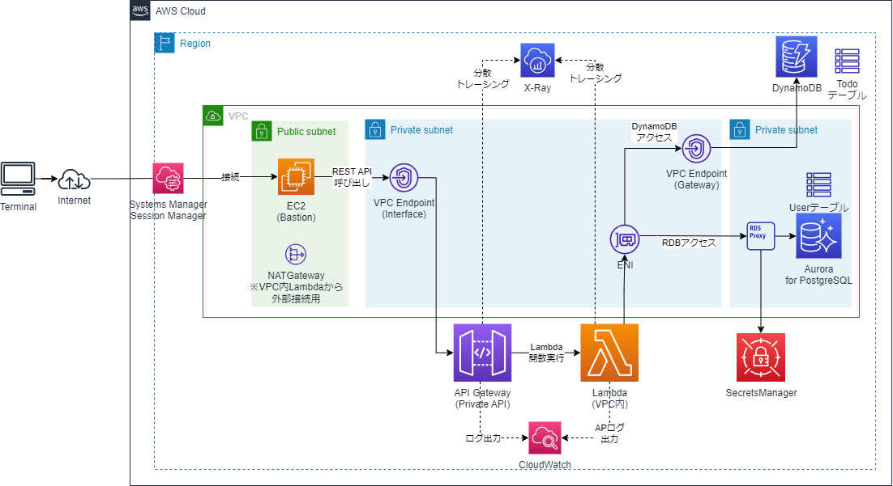

# Private APIでのAPIGatewayを使ったLambda/GoのAWS SAMサンプルAP

## 構成イメージ

* 現状は、API GatewayのPrivate APIに対応した部分に特化して実装
* 今後、サンプルAPとして充足化していく予定

## 1. IAMの作成
```sh
#todo-appフォルダに移動
cd todo-app
#cfnフォルダに移動
cd cfn
aws cloudformation validate-template --template-body file://cfn-iam.yaml
aws cloudformation create-stack --stack-name Demo-IAM-Stack --template-body file://cfn-iam.yaml --capabilities CAPABILITY_IAM
```

## 2. VPCおよびサブネット、InternetGateway等の作成
```sh
aws cloudformation validate-template --template-body file://cfn-vpc.yaml
aws cloudformation create-stack --stack-name Demo-VPC-Stack --template-body file://cfn-vpc.yaml
```

## 3. Security Groupの作成
```sh
aws cloudformation validate-template --template-body file://cfn-sg.yaml
aws cloudformation create-stack --stack-name Demo-SG-Stack --template-body file://cfn-sg.yaml
```

## 4. EC2(Basion)の作成
```sh
aws cloudformation validate-template --template-body file://cfn-bastion-ec2.yaml
aws cloudformation create-stack --stack-name Demo-Bastion-Stack --template-body file://cfn-bastion-ec2.yaml
```
* 必要に応じてキーペア名等のパラメータを指定
    * 「--parameters ParameterKey=KeyPairName,ParameterValue=myKeyPair」

## 5. NAT Gatewayの作成とプライベートサブネットのルートテーブル更新
* 現状は作成不要。VPC内Lambdaからインターネットに接続する場合に必要となる。

```sh
aws cloudformation validate-template --template-body file://cfn-ngw.yaml
aws cloudformation create-stack --stack-name Demo-NATGW-Stack --template-body file://cfn-ngw.yaml
```
## 6. AWS SAMでLambda/API Gatewayの実行
* SAMビルド
```sh
#todo-appフォルダに戻る
cd ..
sam build
# Windowsにmakeをインストールすればmakeでもいけます
make
```

* 必要に応じてローカル実行可能
```sh
sam local invoke
sam local start-api
curl http://127.0.0.1:3000/hello
```

* SAMデプロイ
```sh
# 1回目は
sam deploy --guided
# Windowsにmakeをインストールすればmakeでもいけます
make deploy_guided

# 2回目以降は
sam deploy
# Windowsにmakeをインストールすればmakeでもいけます
make deploy
```

* マネージドコンソールから、EC2(Bation)へSystems Manager Session Managerで接続して、動作確認
```sh
# 例
curl https://5h5zxybd3c.execute-api.ap-northeast-1.amazonaws.com/Prod/hello/
```

## SAMのCloudFormationスタック削除
```sh
# Windowsにmakeをインストールすればmakeでもいけます
make delete
```

## その他のCloudFormationスタック削除
```sh
aws cloudformation delete-stack --stack-name Demo-Bastion-Stack
aws cloudformation delete-stack --stack-name Demo-NATGW-Stack
aws cloudformation delete-stack --stack-name Demo-SG-Stack
aws cloudformation delete-stack --stack-name Demo-VPC-Stack 
aws cloudformation delete-stack --stack-name Demo-IAM-Stack 
```